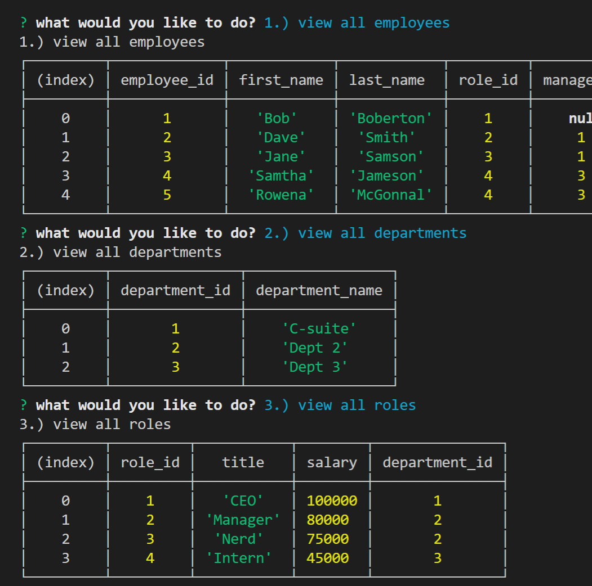

  
# Employee Tracker

## Description 
The purpose of this project is to use the command line to add/view departments, roles and employees. 

## Project Demonstration
  

## Table of contents

- [Description](#description)
- [Installation](#installation)
- [Usage](#usage)
- [License](#license)
- [Contributing](#contributing)
- [Questions](#questions)
- [Repository Link](#repository)

## Installation

        Step 1.) Copy the Seed file into SQL, so that the tables are setup with some base data. 

## Usage

        Step 1.) Open up index.js in the command terminal, run node index.js 2.) Answer the questions depending on your use case. 

## License
MIT 

## Contributing

The owner of this project is KJ-Labs, you're welcome to contribute.

## Questions

- If you have any questions, please contact me on Github.
- undefined
- [KJ-Labs](https://github.com/KJ-Labs)

## Repository

- [Project Repo](https://github.com/KJ-Labs/Employee-Tracker)

## Screenshots
  

